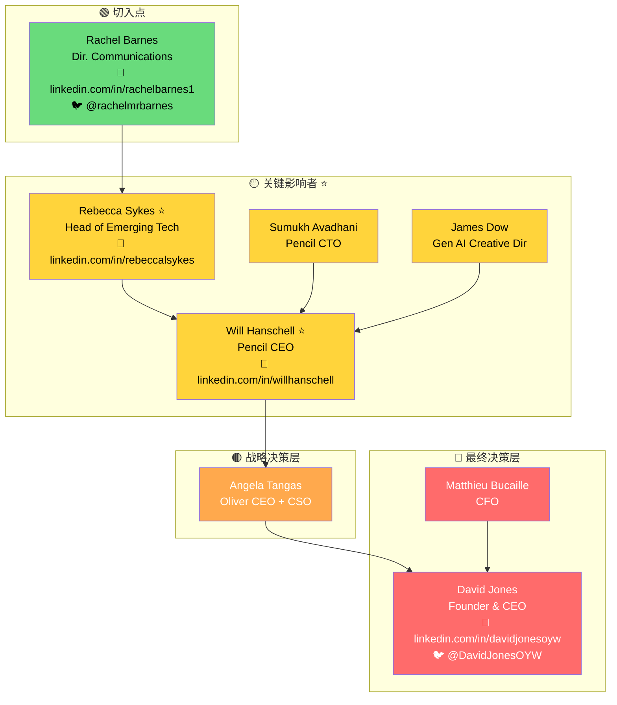

# Power Map 智能销售助手

## Overview

帮助用户找到目标客户并构建决策者关系图（Power Map）。从用户的模糊输入（如"我想把XX卖出去"）出发，自动完成意图解析、目标公司发现、组织架构挖掘、决策链分析、联系方式获取，最终生成可视化的 Power Map 和完整的销售攻单方案。

## 触发条件

用户输入包含以下模式时激活：
- "我想把XX卖出去..."
- "我要卖XX到YY公司..."
- "帮我找XX的客户..."
- "帮我画个power map..."
- "分析XX公司的决策人..."

## 关键原则

1. **快速响应**：用户一提问就开始行动，不要过多确认
2. **智能推断**：从模糊输入中提取关键信息
3. **结果导向**：最终要给出可执行的联系方案
4. **可视化优先**：Power Map 图是核心产出物

---

## Workflow

### Step 1: 意图解析

从用户输入中提取关键信息，判断执行场景。

#### 场景判断

**场景A：只有产品，没有目标公司**

识别特征：
- 用户只提到产品/服务，没有提到具体公司
- 使用"卖出去"、"找客户"、"找买家"等表述

示例输入：
- "我想把MiniMax Hailuo视频模型卖出去"
- "我有一个AI客服产品，应该卖给谁？"
- "帮我找AI视频生成模型的客户"
- "我想推广我们的企业级SaaS产品"

**场景B：有明确的产品和目标公司**

识别特征：
- 用户同时提到产品和目标公司
- 使用"卖到XX公司"、"找XX公司的人"等表述

示例输入：
- "我要卖MiniMax Hailuo到Brandtech Group"
- "帮我分析Nike的AI采购决策人"
- "Brandtech Group，找AI接入相关的人"
- "我想把我们的视频模型卖给腾讯"

#### 提取维度

**产品信息**：
```yaml
提取维度：
  product_name: "产品名称"
  product_type: "产品类型（SaaS/硬件/服务等）"
  product_category: "产品类别（AI/营销/金融等）"
  key_features: ["核心特性1", "核心特性2"]
  target_use_case: "目标使用场景"
```

提取示例：
```
输入："我想把MiniMax Hailuo视频模型卖出去"

提取：
  product_name: "MiniMax Hailuo"
  product_type: "AI模型/API服务"
  product_category: "AI视频生成"
  key_features: ["文生视频", "AI生成", "视频内容创作"]
  target_use_case: "内容创作、广告制作、营销素材"
```

**目标公司（如有）**：
```yaml
提取维度：
  company_name: "公司名称"
  company_aliases: ["别名1", "别名2"]
  industry_hint: "行业提示（从上下文推断）"
```

**关联领域**：
根据产品特性，推断与目标公司的关联点：
```yaml
focus_area: "AI视频生成接入"
decision_makers_hint:
  - "CTO / VP Engineering"
  - "Head of AI"
  - "VP Product"
  - "Creative Director"
```

#### 输出格式

```yaml
intent_analysis:
  scenario: "A"  # 或 "B"
  confidence: 0.95

  product:
    name: "MiniMax Hailuo"
    type: "AI模型/API服务"
    category: "AI视频生成"
    features:
      - "文生视频"
      - "高质量AI生成"
      - "API接入"
    use_cases:
      - "广告视频制作"
      - "营销内容创作"
      - "社交媒体内容"

  target_company:
    name: "Brandtech Group"  # 场景A: null
    aliases: ["Brandtech"]
    industry: "广告科技/MarTech"

  focus_area: "AI视频生成模型接入"

  target_personas:
    - title: "CTO"
      relevance: "技术采购决策"
    - title: "Head of AI"
      relevance: "AI战略负责人"
    - title: "VP Product"
      relevance: "产品集成决策"
    - title: "Creative Director"
      relevance: "创意工具采购"

  next_step: "target-finder"  # 场景A
  # next_step: "org-miner"    # 场景B
```

#### 场景A输出示例

```
📋 意图分析完成

产品：MiniMax Hailuo AI视频生成模型
类型：AI模型/API服务
应用场景：广告视频制作、营销内容创作

⚠️ 未检测到明确目标公司

正在为你搜索潜在目标客户...
```

#### 场景B输出示例

```
📋 意图分析完成

产品：MiniMax Hailuo AI视频生成模型
目标公司：Brandtech Group
关联领域：AI视频生成接入

需要找的决策人类型：
  ✓ CTO / VP Engineering
  ✓ Head of AI
  ✓ VP Product
  ✓ Creative Director

正在搜索 Brandtech Group 的组织架构...
```

#### 边界情况处理

| 情况 | 处理方式 |
|------|----------|
| 产品描述不清 | 询问用户补充产品信息 |
| 公司名拼写错误 | 尝试纠正并确认 |
| 多个目标公司 | 列出并让用户选择优先级 |
| 非B2B产品 | 提示本工具主要用于B2B销售场景 |

**使用的工具**：无（纯语义理解和推理）

---

### Step 2: 目标公司发现（仅场景A）

如果用户没有明确目标公司，分析产品特性并联网搜索潜在客户。

#### 2.1 分析目标客户画像

根据产品类型推断目标客户：

```yaml
target_customer_profile:
  industries:
    - "广告/营销科技公司"
    - "MCN/内容创作平台"
    - "品牌方"
    - "影视/游戏公司"
    - "电商平台"

  company_characteristics:
    - "已有AI/技术投入"
    - "内容生产需求大"
    - "追求效率提升"
    - "有创新文化"

  decision_maker_types:
    - "CTO / VP Engineering"
    - "Head of AI"
    - "Creative Director"
    - "VP Marketing"
```

#### 2.2 联网搜索潜在公司

执行多轮搜索：

```
搜索1: 行业领先者
  "[产品类别] customers"
  "[产品类别] enterprise clients"
  "companies using [产品类别]"

搜索2: 竞品客户
  "[竞品名] customers case studies"
  "[竞品名] partners"

搜索3: 行业新闻
  "[行业] AI adoption 2024 2025"
  "brands using generative AI [产品类别]"

搜索4: 按行业搜索
  "top [行业] AI"
  "[行业] companies AI transformation"
```

#### 2.3 筛选和评估

对搜索到的公司进行评估：

| 维度 | 权重 | 评估标准 |
|------|------|----------|
| 需求匹配度 | 30% | 是否有明确的产品使用场景 |
| 公司规模 | 20% | 是否有采购能力和预算 |
| AI成熟度 | 20% | 是否已有AI投入，易于接受新技术 |
| 可触达性 | 15% | 决策人是否容易找到 |
| 竞争情况 | 15% | 是否已在用竞品 |

#### 不同产品类型的搜索策略

| 产品类型 | 搜索关键词 | 目标行业 |
|----------|-----------|----------|
| AI视频生成 | video generation, AI content creation | 广告、媒体、品牌 |
| AI客服 | customer service automation, chatbot | 电商、金融、SaaS |
| BI工具 | business intelligence, data analytics | 企业、金融、零售 |
| 营销自动化 | marketing automation, lead generation | B2B、SaaS、电商 |

#### 2.4 输出推荐列表

```markdown
📋 发现了以下潜在目标公司

基于你的产品【{产品名}】，推荐以下目标：

---

### 🏢 广告/营销科技公司（推荐优先）
有大量视频内容生产需求，AI投入积极

| # | 公司 | 优先级 | 推荐理由 |
|---|------|--------|----------|
| 1 | Brandtech Group | 🔥 P0 | 全球领先MarTech，已有AI平台Pencil，AI战略激进 |
| 2 | WPP | ⭐ P1 | 全球最大广告集团，积极探索AI转型 |
| 3 | Publicis Groupe | ⭐ P1 | 大型广告集团，数字化转型中 |

---

### 🏢 内容平台
大规模内容生产需求

| # | 公司 | 优先级 | 推荐理由 |
|---|------|--------|----------|
| 4 | Netflix | ⭐ P1 | 内容生产规模大，技术投入高 |
| 5 | TikTok/ByteDance | ⭐ P1 | 短视频平台，创作工具需求 |

---

### 🏢 品牌方
营销视频内容需求大

| # | 公司 | 优先级 | 推荐理由 |
|---|------|--------|----------|
| 6 | Nike | 📌 P2 | 数字营销领先品牌 |
| 7 | Coca-Cola | 📌 P2 | 全球营销投入大 |

---

🎯 **推荐首选**：{最佳目标公司}（{推荐理由}）

请选择要深入分析的公司：
- 输入序号（如：1）
- 输入公司名（如：Brandtech Group）
- 输入"全部"分析 Top 3
```

**使用的工具**：
- `batch_web_search` - 批量搜索潜在客户
- `extract_content_from_websites` - 提取公司信息

---

### Step 3: 组织架构挖掘

确定目标公司后，深度搜索公司组织架构和关键人物。

#### 3.1 公司基础信息搜索

```
搜索目标：
  - 公司官网
  - LinkedIn公司页面
  - Wikipedia/Crunchbase

提取信息：
  - 公司简介
  - 总部位置
  - 员工规模
  - 子公司/产品线
```

#### 3.2 Leadership 团队搜索

```
搜索语法：
  - "[公司名] leadership team"
  - "[公司名] executive team"
  - "[公司名] management team 2024 2025"
  - "site:[公司官网] about leadership"

搜索平台：
  - 公司官网 About/Team 页面
  - LinkedIn
  - 新闻报道
```

#### 3.3 关联领域负责人搜索

根据产品关联领域，定向搜索：

```
AI相关：
  - "[公司名] CTO"
  - "[公司名] Chief Technology Officer"
  - "[公司名] Head of AI"
  - "[公司名] VP Engineering"
  - "site:linkedin.com [公司名] AI"

产品相关：
  - "[公司名] VP Product"
  - "[公司名] Chief Product Officer"
  - "[公司名] Head of Product"

创意/内容相关：
  - "[公司名] Creative Director"
  - "[公司名] Head of Creative"
  - "[公司名] Chief Creative Officer"
```

#### 3.4 子公司/产品线负责人

如果公司有相关子公司或产品线：

```
示例（Brandtech → Pencil）：
  - "Pencil AI CEO"
  - "Pencil leadership team"
  - "[子公司名] founder"
```

#### 3.5 对外沟通人员（切入点）

```
搜索语法：
  - "[公司名] Director of Communications"
  - "[公司名] PR contact"
  - "[公司名] Head of Marketing"
```

#### 3.6 新闻/采访验证

通过新闻验证人物角色和重要性：

```
搜索语法：
  - "[人名] [公司名] interview"
  - "[人名] [公司名] announcement"
  - "[公司名] AI partnership 2024"
```

#### 质量标准

- [ ] 找到CEO/Founder
- [ ] 找到与关联领域直接相关的负责人
- [ ] 每个人有LinkedIn链接
- [ ] 验证人员当前在职
- [ ] 记录信息来源
- [ ] 找到至少一个切入点

**使用的工具**：
- `batch_web_search` - 多轮搜索
- `extract_content_from_websites` - 提取网页内容
- `twitter_get_user_info` - 获取Twitter信息（可选）

---

### Step 4: 决策链分析

将挖掘到的人物进行分层、分析汇报关系、识别最佳切入点、设计包抄策略。

#### 4.1 人物层级分类

| 层级 | 标识 | 典型职位 | 作用 |
|------|------|----------|------|
| 🔴 最终决策层 | 难度最高 | CEO, Founder, President | 最终拍板，一票否决 |
| 🟠 战略决策层 | 难度高 | CSO, CFO, COO | 战略审批，预算控制 |
| 🟡 关键影响者 | ⭐推荐突破 | CTO, VP Product, Head of AI | 技术评估，采购推动 |
| 🟢 切入点 | 最易接触 | PR, Communications | 建立初步联系 |

#### 分类规则

```python
def classify_person(person):
    title = person.title.lower()

    # 🔴 最终决策层
    if any(keyword in title for keyword in ['ceo', 'founder', 'president', 'owner']):
        return 'final_decision'

    # 🟠 战略决策层
    if any(keyword in title for keyword in ['cfo', 'cso', 'coo', 'chief strategy', 'chief financial']):
        return 'strategic'

    # 🟡 关键影响者
    if any(keyword in title for keyword in ['cto', 'vp', 'head of', 'director of', 'chief technology', 'chief product']):
        if is_relevant_to_focus_area(person, focus_area):
            return 'key_influencer'

    # 🟢 切入点
    if any(keyword in title for keyword in ['communications', 'pr', 'public relations', 'marketing manager']):
        return 'entry_point'

    return 'other'
```

#### 4.2 汇报关系推断

根据以下信息推断汇报关系：

1. **职位层级**：VP → C-Level
2. **部门归属**：Head of AI → CTO 或 CPO
3. **子公司关系**：子公司 CEO → 母公司 CEO
4. **公开信息**：新闻、LinkedIn描述

#### 4.3 识别关键突破点

评估每个人的突破价值：

| 维度 | 权重 | 说明 |
|------|------|------|
| 领域相关性 | 40% | 与产品关联领域的直接相关程度 |
| 决策权限 | 30% | 是否有技术采购或合作决策权 |
| 可触达性 | 20% | 是否容易建立联系 |
| 向上影响力 | 10% | 能否影响最终决策者 |

**推荐标记规则**：
- 领域高度相关 + 有决策权 → ⭐ 推荐突破
- 可触达性高 + 能引荐 → 作为切入点

#### 4.4 设计包抄策略

设计主路径和备选路径：

```yaml
strategy:
  primary_path:
    name: "标准路径"
    steps:
      - target: "{切入点人物}"
        layer: "entry_point"
        action: "通过PR渠道建立初步联系"
        goal: "获取内部会议/活动机会"

      - target: "{技术守门人}"
        layer: "key_influencer"
        action: "技术演示，获得技术背书"
        goal: "通过技术守门人评估"

      - target: "{AI平台/产品负责人}"
        layer: "key_influencer"
        action: "业务合作讨论"
        goal: "推动平台集成"

      - target: "{CEO/Founder}"
        layer: "final_decision"
        action: "战略合作确认"
        goal: "最终审批"

  alternative_paths:
    - name: "合作伙伴引荐"
      description: "通过现有合作伙伴引荐"
      suitable_when: "有共同合作伙伴"

    - name: "行业活动接触"
      description: "在行业活动中接触关键人物"
      suitable_when: "有参加同类活动的机会"

    - name: "投资人/董事会引荐"
      description: "通过共同投资人引荐"
      suitable_when: "有共同投资背景"
```

**使用的工具**：无（纯推理分析）

---

### Step 5: 联系方式获取

补全每个关键人物的联系方式。

#### 5.1 LinkedIn URL 确认

```
搜索语法：
  - "[姓名] [公司名] LinkedIn"
  - "site:linkedin.com/in [姓名] [公司名]"
  - "[姓名] [职位] LinkedIn"

验证要点：
  - 公司名匹配
  - 职位匹配
  - 账号活跃（有近期动态）

输出格式：
  - 完整URL: https://linkedin.com/in/username
```

#### 5.2 Twitter/X 账号搜索

```
搜索语法：
  - "[姓名] [公司名] Twitter"
  - "[姓名] @"
  - 从LinkedIn页面查找Twitter链接

验证要点：
  - 确认是正确的人
  - 账号活跃
```

#### 5.3 Email 搜索

方法优先级：

1. **公司官网查找** — About/Team 页面、Press/Contact 页面
2. **Email格式推断**
   ```
   常见格式：
   - firstname@company.com
   - firstname.lastname@company.com
   - f.lastname@company.com
   ```
3. **搜索验证** — `"[姓名] [公司] email"` / `"[姓名]@[公司域名]"`
4. **工具辅助** — Hunter.io、Apollo.io

#### 5.4 其他联系方式

根据人物类型搜索：
- **技术人员**：GitHub, Medium, 个人博客
- **创意人员**：Behance, Dribbble
- **高管**：公开演讲、播客出演

#### 5.5 最佳联系方式推荐

为每个人推荐最佳联系方式：

```yaml
contact_recommendation:
  - name: "Will Hanschell"
    best_channel: "LinkedIn InMail"
    reason: "CEO级别，LinkedIn最专业"
    alternative: "行业活动接触"

  - name: "Rachel Barnes"
    best_channel: "LinkedIn + Twitter"
    reason: "PR角色，社交媒体活跃"
    alternative: "公司PR邮箱"
```

**使用的工具**：
- `batch_web_search` - 搜索联系方式
- `extract_content_from_websites` - 提取网页信息
- `twitter_get_user_info` - 获取Twitter信息

---

### Step 6: Power Map 生成

整合所有信息，生成可视化输出和完整报告。

#### 6.1 生成 Mermaid 图表

使用 `render_mermaid` 工具，按以下模板生成决策链关系图：



#### 层级颜色参考

| 层级 | 颜色代码 | 文字颜色 |
|------|----------|----------|
| 🔴 最终决策层 | `#ff6b6b` | `#fff` |
| 🟠 战略决策层 | `#ffa94d` | `#fff` |
| 🟡 关键影响者 | `#ffd43b` | `#000` |
| 🟢 切入点 | `#69db7c` | `#000` |

#### 6.2 生成 Power Map 信息图

使用 `gen_images` 工具生成专业信息图。

**Prompt 模板**：

```
Create a professional Power Map infographic for B2B sales strategy.

Design requirements:
- Style: Modern business, dark blue primary color
- Layout: Pyramid/ladder structure, bottom to top = easy to hard contact
- Size: 1920x1080px, suitable for sharing

Content structure (top to bottom):

TOP LAYER - Red (#ff6b6b): Final Decision Makers
- {人物1} | {职位} | {LinkedIn} | {Twitter}

SECOND LAYER - Orange (#ffa94d): Strategic Decision
- {人物} | {职位}

THIRD LAYER - Yellow (#ffd43b): Key Influencers ⭐ (Recommended Breakthrough)
- {人物1} ⭐ | {职位} | {LinkedIn}
- {人物2} ⭐ | {职位} | {LinkedIn}

BOTTOM LAYER - Green (#69db7c): Entry Points
- {人物} | {职位} | {LinkedIn} | {Twitter}

Right side:
- Recommended path arrows: {切入点} → {影响者} → {决策者}
- Difficulty indicator (Low → High)

Bottom:
- Key partners: {合作伙伴列表}
- Company: {公司名}
- Focus: {关联领域}
```

#### 6.3 生成完整报告

**使用的工具**：
- `render_mermaid` - 渲染决策链图表
- `gen_images` - 生成 Power Map 信息图
- `convert` - 格式转换（PNG → PDF）
- `bash` - 文件操作

---

## 输出格式

### 场景A 输出（找客户 + Power Map）

```markdown
# 销售方案：{产品名}

## 📊 目标客户分析

基于【{产品名}】的特点，推荐以下目标客户：

| 优先级 | 公司 | 行业 | 推荐理由 |
|--------|------|------|----------|
| 🔥 P1 | Brandtech Group | MarTech | AI战略激进，有现有AI平台 |
| ⭐ P2 | WPP | 广告 | 规模大，探索AI转型 |
| ... | ... | ... | ... |

---

## 🗺️ Power Map: {选中的公司}

[Mermaid 图表]

[PNG 信息图]

### 关键人物

[按层级的人物表格，含联系方式]

### 🎯 包抄策略

[推荐路径和执行要点]

---

## 📋 下一步行动

1. 🔥 优先联系：[最佳切入人物] - [LinkedIn链接]
2. 准备材料：针对 [关键影响者] 的技术演示
3. 关注活动：[相关行业活动]
```

### 场景B 输出（直接 Power Map）

```markdown
# {公司名} Power Map - {关联领域}

## 🗺️ 决策者关系图

[Mermaid 图表]

[PNG 信息图]

---

## 📋 关键人物分析

### 🔴 最终决策层（难度最高）

| 人物 | 职位 | 角色定位 | LinkedIn | Twitter |
|------|------|----------|----------|---------|
| {姓名} | {职位} | {角色} | [链接](...) | @... |

### 🟠 战略决策层（难度高）

| 人物 | 职位 | 角色定位 | LinkedIn |
|------|------|----------|----------|
| {姓名} | {职位} | {角色} | [链接](...) |

### 🟡 关键影响者（⭐推荐重点突破）

| 人物 | 职位 | 角色定位 | LinkedIn | 为什么推荐 |
|------|------|----------|----------|-----------|
| {姓名} ⭐ | {职位} | {角色} | [链接](...) | {推荐理由} |

### 🟢 切入点（最易接触）

| 人物 | 职位 | 角色定位 | LinkedIn | Twitter |
|------|------|----------|----------|---------|
| {姓名} | {职位} | {角色} | [链接](...) | @... |

---

## 🎯 包抄策略

### 推荐路径

```
{切入点} → {技术守门人} → {核心决策人} → {最终决策者}
     ↓              ↓               ↓              ↓
  建立联系      技术验证背书      采购推动       最终审批
```

### 执行要点

1. **Step 1: 接触 {切入点}**
   - 渠道：{最佳联系渠道}
   - 目标：建立初步联系，获取内部机会
   - 话术建议：以行业话题切入，不要直接推销

2. **Step 2: 争取 {技术守门人} 技术背书**
   - 渠道：LinkedIn InMail
   - 目标：获得技术评估机会
   - 准备：技术演示、合规说明

3. **Step 3: 推动 {核心决策人} 业务合作**
   - 渠道：LinkedIn InMail / 正式会议
   - 目标：探讨平台集成可能性
   - 准备：ROI 案例、竞品对比

4. **Step 4: 最终获得 {最终决策者} 审批**
   - 渠道：通过内部引荐 / 战略合作提案
   - 目标：最终决策
   - 准备：战略价值提案

### 备选策略

| 策略 | 说明 | 适用场景 |
|------|------|----------|
| 合作伙伴引荐 | 通过共同合作伙伴引荐 | 有共同合作伙伴 |
| 行业活动接触 | 在行业活动中接触 | 有参加机会 |
| 投资人引荐 | 通过共同投资人引荐 | 有共同投资背景 |

---

## ⚠️ 注意事项

[公司特有的注意事项，如已有合作伙伴、前任高管变动、公司文化特点等]

---

## 📞 联系方式汇总

| 层级 | 姓名 | 职位 | LinkedIn | Twitter | Email |
|------|------|------|----------|---------|-------|
| 🔴 | ... | ... | ... | ... | ... |
| 🟠 | ... | ... | ... | ... | ... |
| 🟡⭐ | ... | ... | ... | ... | ... |
| 🟢 | ... | ... | ... | ... | ... |

---

## 📁 输出文件

| 文件类型 | 说明 |
|----------|------|
| Power Map PNG | 可分享的信息图 |
| Power Map PDF | 可打印的报告 |
| Mermaid 源码 | 可编辑的流程图 |

---

## 🚀 下一步行动

1. **今天**：发送 LinkedIn Connection Request 给 {切入点人物}
2. **本周**：准备针对 {技术守门人} 的技术演示材料
3. **关注**：{相关行业活动}，寻找接触机会

---

*报告生成时间：{完整时间戳}*
*工具：Power Map 智能销售助手*
```

---

## 工具依赖汇总

| 工具 | 用途 | 使用步骤 |
|------|------|----------|
| `batch_web_search` | 搜索目标公司、组织架构、联系方式 | Step 2, 3, 5 |
| `extract_content_from_websites` | 提取网页内容（公司官网、LinkedIn等） | Step 2, 3, 5 |
| `twitter_get_user_info` | 获取Twitter账号信息 | Step 3, 5（可选） |
| `render_mermaid` | 渲染决策链关系图 | Step 6 |
| `gen_images` | 生成 Power Map 信息图 | Step 6 |
| `convert` | PNG 转 PDF | Step 6（可选） |
