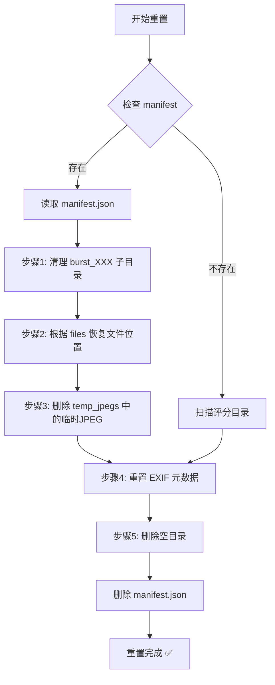

# 📋 Manifest.json 机制说明

## 概述

SuperPicky 使用 `.superpicky_manifest.json` 文件来记录所有文件移动操作，以便在需要时能够**完整恢复**到处理前的状态。这是一个**可逆操作设计**的核心机制。

---

## 📍 Manifest 文件位置

```
[照片目录]/
├── .superpicky_manifest.json   ← 位于处理目录根目录
├── .superpicky/
│   ├── report.csv
│   └── debug_crops/
├── 3星_优选/
│   └── 红嘴蓝鹊/
│       └── _Z9W1234.NEF
└── 2星_良好/
    └── ...
```

> [!NOTE]
> BirdID CLI 使用 `.birdid_manifest.json`，结构类似。

---

## 🗂️ Manifest 数据结构

```json
{
  "version": "2.0",
  "created": "2026-01-25T10:30:00.000000",
  "app_version": "V4.0.1",
  "original_dir": "/Users/xxx/Photos/Birds",
  "folder_structure": {
    "3": "3星_优选",
    "2": "2星_良好",
    "1": "1星_普通",
    "0": "0星_放弃"
  },
  "bird_species_dirs": true,
  "files": [
    {
      "filename": "_Z9W1234.NEF",
      "rating": 3,
      "folder": "3星_优选/红嘴蓝鹊",
      "bird_species": {
        "cn_name": "红嘴蓝鹊",
        "en_name": "Red-billed Blue Magpie"
      }
    },
    {
      "filename": "_Z9W1235.NEF",
      "rating": 2,
      "folder": "2星_良好/其他鸟类",
      "bird_species": ""
    }
  ],
  "temp_jpegs": [
    "_Z9W1234.jpg",
    "_Z9W1235.jpg"
  ],
  "stats": {
    "total_moved": 150
  }
}
```

### 关键字段说明

| 字段 | 说明 |
|------|------|
| `version` | Manifest 版本号，V4.0 升级为 `2.0` |
| `files` | 记录每个被移动文件的**原始文件名**和**目标目录** |
| `temp_jpegs` | 📌 **临时转换的 JPEG 文件列表** (V4.0 新增) |
| `bird_species_dirs` | 标记是否使用了鸟种分目录结构 |

---

## 🔄 重置 (Reset) 流程

当用户点击「重置」按钮或运行 `superpicky_cli.py reset` 时：



### 步骤详解

1. **清理连拍子目录** — 将 `burst_001/` 等目录中的文件移回父评分目录
2. **恢复文件位置** — 根据 `files` 数组，将每个文件从 `folder` 移回主目录
3. **删除临时 JPEG** — 🔑 根据 `temp_jpegs` 数组，删除 RAW 转换生成的临时 JPEG
4. **重置 EXIF** — 清除 Rating、Pick、Label、City、State、Country、Title 等字段
5. **删除空目录** — 清理 `3星_优选/`、`红嘴蓝鹊/` 等已为空的目录

---

## 🗑️ 临时 JPEG 删除机制

### 为什么需要记录临时 JPEG？

SuperPicky 处理 RAW 文件时，会临时转换为 JPEG 用于 AI 分析：

```
原始目录/
├── _Z9W1234.NEF   (用户原始 RAW)
├── _Z9W1234.jpg   ← 临时转换的 JPEG (AI 分析用)
└── _Z9W1235.NEF
```

> [!IMPORTANT]
> V4.0 之前，重置时会**误删用户自己拍摄的 RAW+JPEG** 组合中的 JPEG。
> 
> V4.0 引入 `temp_jpegs` 数组，**只删除程序临时生成的 JPEG**，保护用户原始文件。

### 实现代码

**写入阶段** (`core/photo_processor.py`):

```python
# 处理完成后生成 manifest
manifest = {
    ...
    "temp_jpegs": list(self.temp_converted_jpegs),  # 记录临时 JPEG
    ...
}
```

**重置阶段** (`exiftool_manager.py`):

```python
# 读取 manifest 并删除临时 JPEG
temp_jpegs = manifest.get('temp_jpegs', [])
for jpeg_filename in temp_jpegs:
    jpeg_path = os.path.join(dir_path, jpeg_filename)
    if os.path.exists(jpeg_path):
        os.remove(jpeg_path)
```

---

## 📊 相关代码位置

| 模块 | 文件 | 功能 |
|------|------|------|
| 写入 Manifest | `core/photo_processor.py` L1451-1471 | 处理完成后生成 manifest |
| 读取并恢复 | `exiftool_manager.py` L574-738 | `restore_files_from_manifest()` |
| GUI 重置 | `ui/main_window.py` L1407-1543 | `_reset_directory()` |
| CLI 重置 | `superpicky_cli.py` L245-345 | `cmd_reset()` |
| BirdID CLI | `birdid_cli.py` L439-544 | `cmd_reset()` (使用 `.birdid_manifest.json`) |

---

## ✅ 设计优点

1. **完全可逆** — 用户可以随时恢复到处理前的状态
2. **保护原始文件** — `temp_jpegs` 机制防止误删用户照片
3. **支持多层目录** — V4.0 支持鸟种子目录 (`3星_优选/红嘴蓝鹊/`)
4. **版本兼容** — 通过 `version` 字段支持未来扩展

---

## 🔗 相关命令

```bash
# CLI 重置
python superpicky_cli.py reset ~/Photos/Birds -y

# BirdID CLI 重置
python birdid_cli.py reset ~/Photos/Birds -y
```
